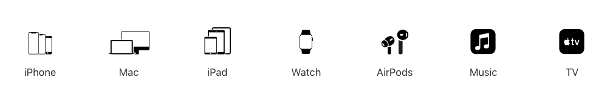
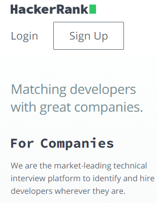
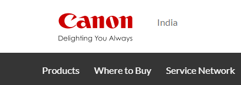
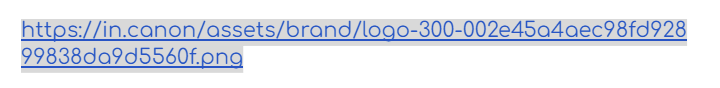

# Dom Manipulation Assignment

1. Webiste Name: [Dev To](https://dev.to/)

### Topics

    - Query Selctory, Inner HTML

### Sample Image


### Tasks

        Target the Top description div and change the DEV Community to <Your_Name> and description to your passion

### **Solution** 🚀

```javascript
let title = document.querySelector(".crayons-subtitle-2.lh-tight.mb-4"); //targets the element
title.innerHTML = "iNeuron"; //changes it to the desired name

let description = (document.querySelector(".color-base-70.mb-4").innerHTML =
  "I write code."); // this changes the description
```

### Output


2. Website Name: [Apple](https://support.apple.com/en-in)

### Task



### Fetch all the product name and store in an array

### **Solution** 🚀

```javascript
let products = document.querySelectorAll(
  "body > div.main > div.as-imagegrid-wrapper.row.as-imagegrid--7up.as-imagegrid--base > div"
); //gets all the product value as a node
let productArr = []; //creates an empty array

for (let product of products) {
  let productName = product.innerText;
  productArr.push(productName);
} //using for of loop to itterate the value with product name and pushing it to the empty array

console.log(productArr);
```

### Output

['iPhone', 'Mac', 'iPad', 'Watch', 'AirPods', 'Music', 'TV']

3. Webiste Name: [Youtube Support](https://support.google.com/youtube/)

### Topics

    - Get Element By Id, Create Element, Create Text Node, Append Child

### Sample Image


### Tasks

     Add another FAQ 'My New FAQ' to the list

### **Solution** 🚀

```javascript
//create a new faq element
let newFaq = document.createElement("section");
//creating faqElement to append inside newFaq element
let faqElement = document.createElement("h3");
// Set attributes or properties for the faqElement
faqElement.textContent = "My New FAQ";
newFaq.appendChild(faqElement);
newFaq.className = "parent";
// find the parent element on which the faq element is supposed to be appended
let targetElement = document.querySelector(
  "#hcfe-content > section > div > div > article > nav"
);
// Append the faqElement as a child to the parent element
targetElement.appendChild(newFaq);
```

### Output


4. Webiste Name: [OnePlus](https://service.oneplus.com/in/contact)

### Topics

     Query Selector, InnerText

### Sample Image


### Tasks

      Change the contact number

### **Solution** 🚀

```javascript
//selection of the element
let phoneNumber = document.querySelector(
  "#contactUs > div > div.contactUs--content > div > a:nth-child(1) > div > div.item--subtitle"
);
//changing phone numeber using innerText
phoneNumber.innerText = "9876543210";
```

### Output


5. Webiste Name: [Samsung](https://www.samsung.com/in/offer/online/samsung-fest/)

### Topics

       getElementById, createElement, InnerText, append, setAttribute

### Sample Image


### Tasks

     Target the main div of card and change the Button text to Check out

### **Solution** 🚀

```javascript
// note: we're selecting m30 model as zfold is not available anymore like shown in the picuture
document.querySelector(
  "#my-recommended-product > div > div.my-recommended-product__card-swiper.swiper-container.basic-swiper.swiper-container-initialized.swiper-container-horizontal > div > div.my-recommended-product__card-item-wrap.swiper-slide.js-pf-product-card.swiper-slide-active > div > div.my-recommended-product__card-content > div.my-recommended-product__card-cta-wrap > div > a"
).innerText = "Check Out";
```

### Output


6. Webiste Name: [Adidas](https://www.adidas.co.in/)

### Topics

    -   Query Selector, Event listeners, Changing Styles

### Sample Image


### Tasks

     Target the search box and on hover change thebackground color to red.

     ### **Solution** 🚀

```javascript
//selecting the element
let searchBar = document.querySelector('._input_1f3oz_13');

//adding an event listener to add the hover effect to the searchbar when mouse is hovered
searchBar.addEventListener('mouseenter' , () => {
    searchBar.style.backgroundColor = 'red';
});

//adding an event listener to remove the hover effect when mouse leaves
searchBar.addEventListener('mouseleave' ()=> {
    searchBar.style.backgroundColor = 'white';
});
```

### Output


7. Webiste Name: [MDN Web Docs](https://developer.mozilla.org/en-US/)

### Topics

       Form, Value, Submit

### Sample Image


### Tasks

     To Search a topic in the MDN Search bar.
     First add a text to search in the search bar and then hit the submit search button to search the docs using DOM

### **Solution** 🚀

```javascript
let form = document.getElementById("hp-search-form");
let input = document.getElementById("hp-search-input");
//giving value to the search field
input.value = "for loop";
//using submit method to submit the value
form.submit();
```

### Output


8. Webiste Name: [Google](https://www.google.com/)

### Topics

       Remove Elements

### Sample Image


### Tasks

     Remove alternate languages from the home page languages listed

### **Solution** 🚀

```javascript
//Selecting the language elements using querySelectorAll
let langElements = document.querySelectorAll("#SIvCob > a");
//Using for Loop through all the langElements and removing it with remove() method
for (i = 0; i <= langElements.length; i = i + 2) {
  langElements[i].remove();
}
```

### Output


9. Webiste Name: [Code Wars](https://www.codewars.com/)

### Topics

       Change Font Family, Color of Text.

### Sample Image


### Tasks

    Change the font family of the text to monospace and text color to the logo’s background color.

### **Solution** 🚀

```javascript
//selecting the elements
let textElements = document.getElementsByClassName("text-color-white");
//looping through all the white text color and using the font style property to change it
for (textElement of textElements) {
  textElement.style.fontFamily = "monospace";
  textElement.style.color = "#B1361E";
}
```

### Output


10. Webiste Name: [Freecodecamp](https://www.freecodecamp.org/)

### Topics

       querySelector, mouseover, click eventListener,  callback function, style,

### Sample Image


### Tasks

    Target the button and change background colour on mouseover

### **Solution** 🚀

```javascript
// Select the button element using its complex CSS selector
let button = document.querySelector(
  "#gatsby-focus-wrapper > div > div > main > div.landing-top.container > div > div.col-lg-8.col-lg-offset-2.col-sm-10.col-sm-offset-1.col-xs-12 > a > span.login-btn-text"
);
// Attach an event listener to the button for the mouseover event
button.onmouseover = () => {
  button.style.backgroundColor = "red";
};
```

### Output


11. Webiste Name: [realme](https://www.realme.com/in/)

### Topics

       querySelector,style,background-image

### Sample Image


### Tasks

    change the realme logo to ineuron logo

    ### **Solution** 🚀

```javascript
let anchorElement = document.querySelector("body > header > div > a");

// Set background image using CSS
anchorElement.style.backgroundImage =
  'url("https://ineuron.ai/images/ineuron-logo.png")';

// Set the href attribute for the link
anchorElement.href = "https://ineuron.com";
```

### Output


12. Webiste Name: [Github](https://github.com/)

### Topics

       querySelector,style,background-Color

### Sample Image


### Tasks

     change the background colour of the button to blue.

### **Solution** 🚀

```javascript
document.querySelector("div.col-xl-4 a.btn").style.backgorundColor = "blue";
```

### Output


13. Webiste Name: [Hackerrank](https://www.hackerrank.com/)

### Topics

       querySelector,innerHtml

### Sample Image



### Tasks

Target the top description and change “Matching developers with great companies” to ‘JSBOOTCAMP“.

### **Solution** 🚀

```javascript
document.querySelector(".f1-heading-text").innerText = "JS BOOTCAMP";
```

### Output


14. Webiste Name: [Asus](https://www.asus.com/in/)

### Topics

      querySelector,style,font-size

### Sample Image


### Tasks

       change the fontsize of “Hot Deals” to 80px

### **Solution** 🚀

```javascript
// Select all the elements using querySelectorAll
let hotDeals = document.querySelectorAll(
  ".indexDealsTabBar__listDivTitle__l0M_3"
);
// Using for of to itterate over the nodelist and change the font size
for (hotDeal of hotDeals) {
  hotDeal.style.fontSize = "80px";
}
```

### Output


15. Webiste Name: [Dell](https://www.dell.com/en-in/shop/deals/laptop-deals?gacd=10415953-9016-5761040-285981356-0&dgc=ST&gclid=Cj0KCQjwguGYBhDRARIsAHgRm4-XUDMhhVNyHXb3s1gY4ZBzORr_d9Se-buhJwy7asyUe7YdqEA11eEaAt6UEALw_wcB&gclsrc=aw.ds&nclid=BxjBlpBQsX6pjSHh-L8YYSU77EpfXRkG1AGMB5Wbeu386ykspfrPDnfx_DdFau20)

### Topics

      querySelector,style.textAlign

### Sample Image


### Tasks

       Convert the text “G15 Gaming Laptop” from left to right

### **Solution** 🚀

```javascript
let laptop = document.querySelector(
  "#d560822win9b > section.ps-top > div.ps-system-title-container.ps-title-container > h3"
);
laptop.style.marginLeft = "100px";
```

### Output


16. Webiste Name: [Vercel](https://vercel.com/)

### Topics

     querySelector,innerHTMl

### Sample Image


### Tasks

      change the heading “Start with the developer” to “Start with Scratch”

### **Solution** 🚀

```javascript
document.querySelector(".section_title__VEDfK").innerText =
  "Start with Scratch";
```

### Output


17. Webiste Name: [Sony](https://www.sony.co.in/)

### Topics

    querySelector,innerHTMl

### Sample Image


### Tasks

     change the button text To current Date.

### **Solution** 🚀

```javascript
document.querySelector(".buy-button").innerHTML = date;
```

### Output


18. Webiste Name: [Philips](https://www.philips.co.in/)

### Topics

     querySelector,style,backgroundcolor

### Sample Image


### Tasks

    change the background colour blue to orange

### **Solution** 🚀

```javascript
document.querySelector(".p-f03-footer-container").style.background = "orange";
```

### Output


19. Webiste Name: [Canon](https://in.canon/)

### Topics

          querySelector,src

### Sample Image



### Tasks

    extract the canon logo

### **Solution** 🚀

```javascript
document.querySelector(".logo").scr;
```

### Output



20. Webiste Name: [Oppo](https://www.oppo.com/in/)

### Topics

          querySelector,style,color

### Sample Image


### Tasks

      Change the description colour black to orange

### **Solution** 🚀

```javascript
document.querySelector(".desc").style.color = "orange";
```

### Output


